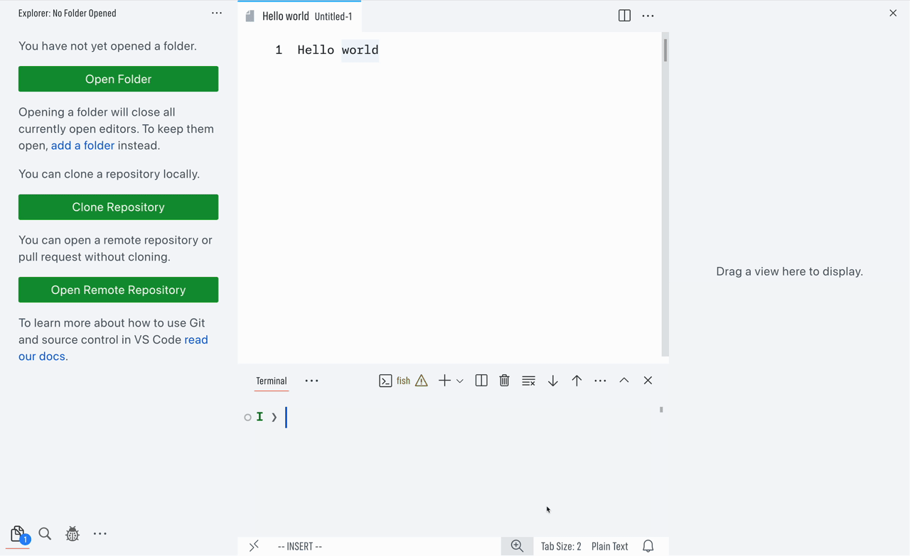

# Sidebars

- **Toggle the visibility of sidebars and the bottom panel** at the same time using one keyboard shortcut:

    ### <kbd>ctrl</kbd> + <kbd>alt</kbd> + <kbd>shift</kbd> + <kbd>0</kbd>
    
    ### <kbd>⌥ alt</kbd> + <kbd>⇧ shift</kbd> + <kbd>⌘ cmd</kbd> + <kbd>0</kbd> on macOS

- **Correctly restores the hidden panels** when the same shortcut is pressed again.

    

- **The only correct implementation of IntelliJ's ‘Hide All Tool Windows’** remembering what state the sidebars and panel are in when hidden, unless and until manually individually revealed or the end of the session.

- **Implemented using context keys** without custom JavaScript. VS&nbsp;Code already has enough JavaScript—let's not add any more. Context keys are used to remember the state of the panels when collapsing and apply per context (in practice, per window) to support individual window toggling.
